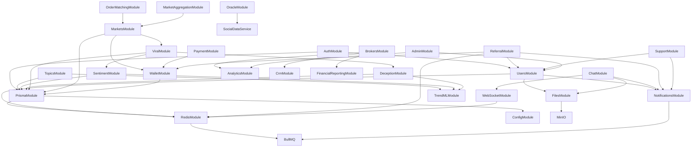

# ViralFX Backend Module Guide

This comprehensive guide documents all modules in the ViralFX backend system, their purposes, services, controllers, endpoints, and integration points.

## Module Dependency Graph



## Core Infrastructure Modules

### PrismaModule
**Purpose**: Database ORM and connection management using Prisma.

**Key Services**:
- `PrismaService`: Database connection, query builder, transaction management

**Dependencies**: None (base module)

**Configuration**:
- Environment variables: `DATABASE_URL`
- Database: PostgreSQL

**Usage Example**:
```typescript
@Injectable()
export class UserService {
  constructor(private prisma: PrismaService) {}

  async findUser(id: string) {
    return this.prisma.user.findUnique({ where: { id } });
  }
}
```

### RedisModule
**Purpose**: Redis caching and session management with proper DI setup.

**Key Services**:
- `RedisService`: High-level Redis operations wrapper

**Dependencies**: ConfigModule

**Configuration**:
- Environment variables: `REDIS_HOST`, `REDIS_PORT`, `REDIS_PASSWORD`, `REDIS_DB`

**Usage Example**:
```typescript
@Injectable()
export class CacheService {
  constructor(@Inject('REDIS_CLIENT') private redis: Redis) {}

  async cacheUser(id: string, data: any) {
    await this.redis.setex(`user:${id}`, 3600, JSON.stringify(data));
  }
}
```

### ConfigModule
**Purpose**: Centralized configuration management using environment variables.

**Configuration Files**:
- `app.config.ts`: Application settings
- `database.config.ts`: Database configuration
- `redis.config.ts`: Redis settings
- `s3.config.ts`: File storage settings
- `jwt.config.ts`: Authentication settings

## Authentication & User Management

### AuthModule
**Purpose**: JWT-based authentication, authorization, and session management.

**Key Services**:
- `AuthService`: JWT token generation, validation, password hashing
- `TokenService`: Refresh token management
- `SessionService`: User session tracking

**Controllers & Endpoints**:
- `POST /auth/login` - User login
- `POST /auth/register` - User registration
- `POST /auth/refresh` - Token refresh
- `POST /auth/logout` - User logout
- `GET /auth/me` - Current user info

**Dependencies**: UsersModule, PrismaModule, RedisModule

**Guards**:
- `JwtAuthGuard`: JWT authentication
- `RolesGuard`: Role-based authorization

### UsersModule
**Purpose**: User profile management, KYC verification, and user preferences.

**Key Services**:
- `UsersService`: User CRUD operations, profile management
- `UserProfileService`: Avatar upload, profile customization
- `KYCService`: Document submission, verification status tracking

**Controllers & Endpoints**:
- `GET /users/me` - Current user profile
- `PUT /users/me` - Update profile
- `POST /users/kyc/submit` - Submit KYC documents
- `GET /users/kyc/status` - KYC verification status

**Dependencies**: AuthModule, FilesModule, NotificationsModule, RedisModule

**Entities**: `User`, `UserProfile`, `KYCDocument`

## Content & Analytics Modules

### TopicsModule
**Purpose**: Topic creation, management, trending detection, and duplicate merging.

**Key Services**:
- `TopicsService`: Topic CRUD, search, categorization
- `TopicMergingService`: Duplicate detection, merge execution
- `TrendingService`: Real-time trending calculation

**Controllers & Endpoints**:
- `GET /topics` - List topics with pagination
- `POST /topics` - Create new topic
- `GET /topics/trending` - Get trending topics
- `POST /topics/:id/merge` - Merge duplicate topics

**Dependencies**: TrendMLModule, PrismaModule

**Processors**:
- `TopicProcessingProcessor` (`topic-merge` queue): Handles asynchronous topic merging

**Entities**: `Topic`, `TopicTrend`, `TopicMerge`

### SentimentModule
**Purpose**: Sentiment analysis of content and real-time aggregation.

**Key Services**:
- `SentimentService`: Individual content sentiment analysis
- `SentimentAggregationService`: Batch processing, topic-level aggregation

**Controllers & Endpoints**:
- `GET /sentiment/topic/:id` - Topic sentiment breakdown
- `POST /sentiment/analyze` - Analyze content sentiment

**Dependencies**: TrendMLModule, PrismaModule

**Processors**:
- `SentimentAnalysisProcessor` (`sentiment-analysis` queue): Batch sentiment processing

**Entities**: `SentimentAnalysis`, `SentimentAggregate`

### DeceptionModule
**Purpose**: Content risk scoring and deception detection.

**Key Services**:
- `DeceptionService`: Risk analysis, content scoring
- `DeceptionAnalysisService`: Component-level analysis, pattern detection

**Controllers & Endpoints**:
- `GET /deception/high-risk` - Get high-risk content
- `POST /deception/analyze` - Analyze content for deception

**Dependencies**: TrendMLModule, PrismaModule

**Processors**:
- `DeceptionDetectionProcessor` (`deception-detection` queue): Async risk analysis

**Entities**: `DeceptionAnalysis`, `RiskScore`

### ViralModule
**Purpose**: Viral index calculation and content virality tracking.

**Key Services**:
- `ViralService`: Viral index calculation, trend prediction
- `ViralIndexService`: Engagement rate calculations

**Controllers & Endpoints**:
- `GET /viral/trending` - Get viral content
- `GET /viral/index/:topicId` - Topic viral index

**Dependencies**: SentimentModule, DeceptionModule, PrismaModule

**Schedulers**:
- `ViralCalculationScheduler` (`@Cron every 5min`): Periodic viral index updates

**Entities**: `ViralIndex`, `ViralTrend`

## Markets & Trading Modules

### MarketsModule
**Purpose**: Binary market creation, betting, and settlement.

**Key Services**:
- `MarketsService`: Market creation, management, resolution
- `BettingService`: Bet placement, validation, payout calculation

**Controllers & Endpoints**:
- `GET /markets` - List available markets
- `POST /markets` - Create new market
- `POST /markets/:id/bet` - Place bet
- `GET /markets/:id` - Market details

**Dependencies**: WalletModule, ViralModule, PrismaModule

**Processors**:
- `MarketSettlementProcessor` (`market-settlement` queue): Market resolution and payouts

**Entities**: `Market`, `Bet`, `MarketOutcome`

### WalletModule
**Purpose**: User wallet management, transactions, and balance tracking.

**Key Services**:
- `WalletService`: Balance management, transaction processing
- `TransactionService`: Transaction history, reconciliation

**Controllers & Endpoints**:
- `GET /wallet/balance` - Current balance
- `GET /wallet/transactions` - Transaction history
- `POST /wallet/deposit` - Initiate deposit
- `POST /wallet/withdraw` - Request withdrawal

**Dependencies**: PrismaModule, PaymentModule

**Entities**: `Wallet`, `Transaction`, `BalanceHistory`

### PaymentModule
**Purpose**: Payment processing, deposits, withdrawals, and payment gateway integration.

**Key Services**:
- `PaymentService`: Payment gateway integration, processing
- `PayoutService`: Withdrawal processing, compliance checks

**Controllers & Endpoints**:
- `POST /payment/deposit` - Process deposit
- `POST /payment/withdraw` - Process withdrawal
- `GET /payment/methods` - Available payment methods

**Dependencies**: WalletModule, PrismaModule

**Entities**: `Payment`, `PaymentMethod`, `Payout`

## Social Features

### ChatModule
**Purpose**: Real-time messaging and topic-based chat rooms.

**Key Services**:
- `ChatService`: Message handling, room management
- `ChatModerationService`: Content moderation, automated filtering

**Controllers & Endpoints**:
- `GET /chat/rooms/:topicId/messages` - Room messages
- `POST /chat/rooms/:topicId/messages` - Send message
- `GET /chat/rooms` - User's chat rooms

**Dependencies**: WebSocketModule, FilesModule, NotificationsModule

**Entities**: `ChatRoom`, `Message`, `MessageReaction`

### ReferralModule
**Purpose**: User referral system with tiered rewards and analytics.

**Key Services**:
- `ReferralService`: Referral code management, tracking
- `RewardService`: Reward calculation, distribution
- `ReferralTrackingService`: Analytics, conversion tracking

**Controllers & Endpoints**:
- `GET /referral/me` - User referral statistics
- `GET /referral/code` - User referral code
- `POST /referral/validate` - Validate referral code
- `GET /referral/leaderboard` - Top referrers
- `GET /rewards/me` - User rewards
- `POST /rewards/:id/claim` - Claim reward

**Dependencies**: UsersModule, WalletModule, NotificationsModule, RedisModule

**Processors**:
- `ReferralProcessingProcessor` (`referral-processing` queue): Referral completion checks
- `RewardDistributionProcessor` (`reward-distribution` queue): Reward payout processing

**Schedulers**:
- `ReferralScheduler`: Daily completion checks, weekly leaderboards, monthly analytics

**Entities**: `Referral`, `ReferralCode`, `Reward`, `RewardClaim`

## Business Operations

### BrokersModule
**Purpose**: FSCA-regulated broker management and client attribution.

**Key Services**:
- `BrokersService`: Broker registration, verification
- `ClientAttributionService`: Client referral tracking
- `BillingService`: Broker billing and commission calculation

**Controllers & Endpoints**:
- `GET /brokers` - List registered brokers
- `POST /brokers/register` - Register new broker
- `GET /brokers/:id/clients` - Broker's clients

**Dependencies**: AnalyticsModule, CrmModule, FinancialReportingModule

**Entities**: `Broker`, `BrokerClient`, `Commission`

### AnalyticsModule
**Purpose**: System-wide analytics, reporting, and metrics collection.

**Key Services**:
- `AnalyticsService`: Metrics calculation, data aggregation
- `ReportingService`: Report generation, scheduled reports

**Controllers & Endpoints**:
- `GET /analytics/dashboard` - Dashboard metrics
- `GET /analytics/reports` - Available reports
- `POST /analytics/reports/generate` - Generate custom report

**Dependencies**: PrismaModule, RedisModule

**Entities**: `AnalyticsMetric`, `Report`, `Dashboard`

### SupportModule
**Purpose**: Customer support ticketing and issue resolution.

**Key Services**:
- `SupportService`: Ticket creation, management
- `EscalationService`: Issue escalation, priority management

**Controllers & Endpoints**:
- `POST /support/tickets` - Create support ticket
- `GET /support/tickets` - User's tickets
- `PUT /support/tickets/:id` - Update ticket

**Dependencies**: UsersModule, NotificationsModule

**Entities**: `SupportTicket`, `TicketResponse`, `TicketCategory`

## Platform Services

### AdminModule
**Purpose**: Administrative functions and system management.

**Key Services**:
- `AdminUserService`: User management, role assignments
- `AdminAnalyticsService`: Administrative analytics
- `AdminWebSocketService`: Admin WebSocket connections

**Controllers & Endpoints**:
- `GET /admin/users` - User management
- `GET /admin/analytics` - Admin analytics
- `POST /admin/system/maintenance` - System maintenance

**Dependencies**: UsersModule, AnalyticsModule, WebSocketModule

### OracleModule
**Purpose**: External data integration and social media data processing.

**Key Services**:
- `SocialDataService`: Social media data ingestion
- `OracleService`: Data validation, external API integration

**Controllers & Endpoints**:
- `GET /oracle/data/:topic` - Topic-related data
- `POST /oracle/webhook` - Data webhook endpoint

**Dependencies**: PrismaModule

**Entities**: `SocialData`, `DataFeed`

### FilesModule
**Purpose**: File upload, storage, and management with MinIO integration.

**Key Services**:
- `FilesService`: File upload, storage, retrieval
- `FileValidationService`: File type validation, security scanning

**Controllers & Endpoints**:
- `POST /files/upload` - Upload file
- `GET /files/:id` - Retrieve file
- `DELETE /files/:id` - Delete file

**Dependencies**: MinIO

**Processors**:
- `FileProcessingProcessor` (`file-processing` queue): Image optimization, virus scanning

**Entities**: `File`, `FileMetadata`

### NotificationsModule
**Purpose**: Multi-channel notifications (in-app, email, SMS, push).

**Key Services**:
- `NotificationService`: Notification creation, delivery
- `EmailService`: Email delivery via templates
- `SMSService`: SMS delivery
- `PushService`: Push notification delivery

**Controllers & Endpoints**:
- `GET /notifications` - User notifications
- `PUT /notifications/:id/read` - Mark as read
- `POST /notifications/preferences` - Update preferences

**Dependencies**: BullMQ

**Processors**:
- `EmailProcessor` (`email` queue): Email delivery
- `InAppProcessor` (`in-app` queue): In-app notifications
- `PushProcessor` (`push` queue): Push notifications
- `SMSProcessor` (`sms` queue): SMS delivery

**Entities**: `Notification`, `NotificationTemplate`, `NotificationPreference`

### WebSocketModule
**Purpose**: Real-time WebSocket connections and event broadcasting.

**Key Services**:
- `WebSocketGateway`: Connection management, authentication
- `DifferentialSyncService`: Real-time data synchronization
- `ConnectionQualityMonitor`: Connection health monitoring

**Dependencies**: RedisModule

**Integration Points**:
- Chat: Real-time messaging
- Markets: Live price updates
- Notifications: Real-time alerts
- Admin: Admin dashboard updates

## Development Guidelines

### Module Structure
Each module should follow this structure:
```
src/modules/{module-name}/
├── {module-name}.module.ts
├── controllers/
├── services/
├── dto/
├── entities/
├── processors/ (if using queues)
├── schedulers/ (if using cron jobs)
└── types/
```

### Queue Processing
- Use BullMQ for all async processing
- Implement proper error handling and retry logic
- Use descriptive job names and metadata
- Monitor queue health and performance

### Database Patterns
- Use Prisma for all database operations
- Implement proper transactions for multi-table operations
- Use database indexes for performance
- Follow naming conventions

### Caching Strategy
- Use Redis for caching frequently accessed data
- Implement proper TTL (time-to-live) policies
- Cache invalidation on data updates
- Use cache warming for predictable loads

### Error Handling
- Use proper HTTP status codes
- Implement global exception filters
- Log errors with sufficient context
- Provide meaningful error messages to clients

### Security
- Validate all inputs with DTOs
- Implement rate limiting on public endpoints
- Use proper authentication and authorization
- Sanitize user-generated content

## Troubleshooting

### Common Issues

**Redis Connection Failures**
- Check Redis server status
- Verify connection parameters in environment
- Check network connectivity
- Monitor Redis memory usage

**Queue Processing Issues**
- Check BullMQ worker status
- Verify Redis connection for queues
- Monitor job failure rates
- Check job payloads for corruption

**Database Performance**
- Check query execution times
- Verify database indexes
- Monitor connection pool usage
- Check for N+1 query problems

**Memory Leaks**
- Monitor application memory usage
- Check for uncleaned up timers/intervals
- Verify proper resource cleanup
- Profile memory allocation patterns

### Health Checks
Each module should implement health checks:
- Database connectivity
- External service dependencies
- Queue health
- Cache connectivity

### Monitoring
Monitor these metrics:
- Request response times
- Error rates by endpoint
- Queue processing times
- Database query performance
- Cache hit/miss ratios
- Memory and CPU usage

## API Reference

### Authentication
All protected endpoints require:
- `Authorization: Bearer <jwt_token>` header
- Valid JWT token with required roles

### Rate Limiting
- Default: 100 requests per minute
- Auth endpoints: 10 requests per minute
- Payment endpoints: 5 requests per minute

### Pagination
List endpoints support:
- `page`: Page number (default: 1)
- `limit`: Items per page (default: 20, max: 100)
- `sort`: Sort field
- `order`: Sort order (asc/desc)

### Error Response Format
```json
{
  "statusCode": 400,
  "message": "Validation failed",
  "error": "Bad Request",
  "details": [
    {
      "field": "email",
      "message": "Invalid email format"
    }
  ]
}
```

## Integration Examples

### Creating a New Module
1. Create module directory structure
2. Define entities and DTOs
3. Implement services with business logic
4. Create controllers with endpoints
5. Add processors for async operations
6. Register module in app.module.ts
7. Add tests and documentation

### Adding Queue Processing
1. Define job interfaces
2. Create processor with @Processor decorator
3. Register queue in module
4. Add jobs to queue from services
5. Implement error handling and retries

### Integrating with External Services
1. Create service wrapper for external API
2. Implement proper error handling
3. Add circuit breaker pattern
4. Monitor service health
5. Handle rate limiting gracefully

This module guide serves as the definitive reference for understanding and working with the ViralFX backend architecture.