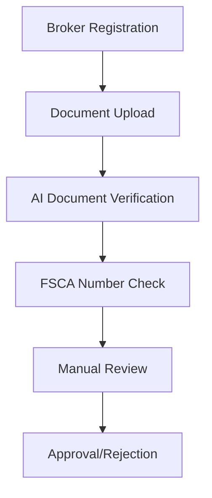

# ViralFX Platform Features - Complete Implementation Guide

## 🔹 Platform-Level Features

### 1. Trend Intelligence Core

#### Multi-platform Feed Collectors
**Platforms Supported:**
- Twitter/X
- TikTok
- Instagram
- YouTube
- Facebook

**Implementation Structure:**
```
backend/src/modules/ingest/connectors/
├── twitter.connector.ts
├── tiktok.connector.ts
├── instagram.connector.ts
├── youtube.connector.ts
└── facebook.connector.ts
```

#### Topic Unification Service
**Purpose:** Merges same story across networks into one "viral topic" entity.

**Core Algorithm:**
```typescript
interface TopicUnifier {
  // Similarity scoring
  calculateSimilarity(content1: Content, content2: Content): number;

  // Cross-platform matching
  findRelatedTopics(newTopic: Topic): Topic[];

  // Merge into unified entity
  mergeTopics(topics: Topic[]): UnifiedTopic;
}
```

#### Filter Engine
**Rule-based + AI Classifier that rejects:**
- Violence content
- Abuse and harassment
- Death and gore
- Pornography
- Hate speech
- Illegal activity

**Implementation:**
```typescript
interface ContentFilter {
  // Rule-based filters
  checkRules(content: Content): FilterResult;

  // AI-based classification
  classifyContent(content: Content): Promise<ClassificationResult>;

  // Combined decision
  shouldFilter(content: Content): Promise<boolean>;
}
```

#### Positive-Bias Tuning
**Preferred Categories:**
- Entertainment
- Music
- Dance
- Education
- Sport
- Tech
- Politics
- Lifestyle

**Configuration:**
```yaml
positive_bias:
  preferred_categories:
    - entertainment
    - music
    - dance
    - education
    - sport
    - tech
    - politics
    - lifestyle
  boost_multiplier: 1.5
```

#### Momentum Matrix
**Measures propagation rate between platforms:**
- Facebook → TikTok → X
- Cross-platform velocity tracking
- Early detection before peak

**Data Structure:**
```typescript
interface MomentumMatrix {
  sourcePlatform: Platform;
  targetPlatform: Platform;
  propagationRate: number;
  timeToPeak: number;
  viralityScore: number;
}
```

#### Regional Tagging
**Default monitoring focused on:**
- South-African geolocation keywords
- Local hashtags
- Regional news outlets
- Local influencers

**Implementation:**
```typescript
interface RegionalFilter {
  country: 'ZA';
  keywords: string[];
  hashtags: string[];
  newsOutlets: string[];
  influencers: string[];
}
```

### 2. Market Intelligence & Indexing

#### Topic Symbol System
Each topic → "VIRAL/SA_TOPIC_ID" symbol format:
```
Examples:
- VIRAL/SA_TKT_001 (TikTok trend #001)
- VIRAL/SA_TW_042 (Twitter trend #042)
- VIRAL/SA_MUSIC_015 (Music trend #015)
```

#### Weighted Attention Score
**Formula:** `volume × velocity × engagement_quality`

```typescript
interface AttentionScore {
  volume: number;        // Raw mention count
  velocity: number;      // Rate of change
  engagement: number;    // Likes, shares, comments ratio
  quality: number;       // Bot/quality assessment
  finalScore: number;
}
```

#### Sentiment + Truth-Tension Overlay
**Filters out disinformation spikes:**
```typescript
interface TruthAnalysis {
  sentimentScore: number;      // -1 to 1
  truthTension: number;        // 0 to 1 (higher = more tension)
  credibilityScore: number;    // Source credibility
  finalAdjustedScore: number;
}
```

#### Historical Replay Mode
**Features:**
- Back-test old virality waves
- Time-travel simulation
- Performance analytics
- Strategy testing

### 3. Broker & Trading Layer

#### Broker Portal Features
- Registration system
- FSCA licence upload
- KYC verification
- Dashboard with metrics
- Client management

#### Broker Verification Workflow


#### OAuth Broker Linking
- Google/Apple OAuth integration
- Custom broker OAuth support
- Secure token exchange
- Account linking API

#### In-house Trading Accounts
**Fallback option when no external broker:**
- Internal wallet system
- Balance management
- Transaction history
- Withdrawal processing

#### Funding & Withdrawals
**Payment Methods:**
- Paystack
- PayFast
- Ozow
- EFT (Electronic Funds Transfer)

#### Compliance Module
- FSCA documentation storage
- Audit trail logging
- Regulatory reporting
- Compliance dashboard

### 4. User Dashboards

#### Trader Dashboard
- Portfolio overview
- Trending topics feed
- Watchlist management
- Open positions tracking
- Price alerts
- Performance metrics

#### Analytics Dashboard
- Sentiment trend charts
- Momentum heat maps
- Social velocity graphs
- Platform comparison
- Time-series analysis

#### Community Feed
- Public sentiment vs price graphs
- Read-only (no comments to reduce abuse)
- Trending visualizations
- Market sentiment indicators

#### Notification Centre
**Multi-channel notifications:**
- Push notifications (mobile/web)
- Email alerts
- In-app notifications
- SMS alerts (critical)

#### Settings Module
- Profile management
- Theme selection (light/dark)
- Security settings (2FA, devices)
- Notification preferences
- Privacy settings

#### Chat System
**Redis pub/sub powered:**
- Peer-to-peer trading chat
- Broker support channels
- Community discussion rooms
- File sharing capabilities
- Message encryption

### 5. Admin / Moderator Console

#### Trend Forensics View
- Viral source chain inspection
- Sentiment timeline analysis
- Flagged content review
- Cross-platform tracking
- Bot detection tools

#### Content Moderation Panel
- Manual override of AI filters
- Content approval workflow
- Moderator assignments
- Action logging
- Appeal management

#### Broker Approval Panel
- FSCA document verification
- License number validation
- Business verification
- Risk assessment
- Approval workflow

#### User Management
- KYC status tracking
- Activity logs
- Suspension/banning tools
- User segmentation
- Behavioral analytics

#### Metrics Dashboards
- Grafana embedded iframes
- Real-time system metrics
- Business intelligence
- Custom report builder
- Alert management

### 6. AI & Filtering

#### Classification Pipeline
```
Language Detection → Sentiment → Toxicity → Category → Virality Score
```

**Stages:**
1. Language detection (English, Afrikaans, isiZulu, isiXhosa)
2. Sentiment analysis (positive/negative/neutral)
3. Toxicity classification
4. Category classification
5. Virality scoring

#### Content-Type Detection
**Using CLIP-like embeddings:**
- Image recognition
- Video analysis
- Text classification
- Mixed media handling

#### Explainability Microservice
**Transparency features:**
- Show why trends were flagged
- Filter decision reasoning
- Confidence scores
- Appeal mechanisms

#### Local Language Support
**Supported languages:**
- English
- Afrikaans
- isiZulu
- isiXhosa

**Sentiment lexicons for local languages.**

### 7. Styling / UI Guidelines

#### Colour Palette
```
Primary  : Deep Purple #4B0082
Accent    : Electric Gold #FFB300
Background: Near-Black #0E0E10
Neutrals  : #1C1C22, #F5F5F5 (light mode)
Rise      : Emerald #00C853
Fall      : Crimson #E53935
```

#### Design System
- **Fonts:** Inter + Manrope pairing
- **Components:** Tailwind + HeadlessUI
- **State:** React Query
- **Charts:** Recharts + Lightweight-Charts
- **Layouts:** Mobile-first, bottom navigation for mobile

#### UI Components
```typescript
// Design token structure
interface DesignTokens {
  colors: {
    primary: '#4B0082';
    accent: '#FFB300';
    background: '#0E0E10';
    surface: '#1C1C22';
    success: '#00C853';
    danger: '#E53935';
  };
  typography: {
    primary: 'Inter';
    secondary: 'Manrope';
  };
  spacing: {
    xs: '0.25rem';
    sm: '0.5rem';
    md: '1rem';
    lg: '1.5rem';
    xl: '2rem';
  };
}
```

### 8. Compliance & Safety

#### Data Privacy (POPIA-Aligned)
- Consent management
- Data retention policies
- User data deletion
- Privacy controls
- Data encryption

#### User-Reported Topics
- Crowd feedback system
- Community moderation
- Trust scoring
- Appeal mechanisms
- Transparency reports

#### Audit Logging
Every action recorded:
- Moderation changes
- Broker approvals
- System modifications
- User activities
- API access

#### AI Ethics Policy
- Transparency documentation
- Filtering rule explanations
- Bias mitigation
- Regular audits
- Ethical review board

### 9. Growth & Engagement

#### Gamified Ranking
- Top traders leaderboard
- Accuracy badges
- Achievement system
- Reputation scores
- Performance rewards

#### Referral Program
- Link-based invites
- Paystack payout integration
- Tiered rewards
- Tracking analytics
- Fraud prevention

#### Education Section
"Learn Viral Markets" micro-courses:
- Platform tutorials
- Trading strategies
- Risk management
- Market analysis
- Expert insights

#### Community Contests
"Predict the next viral hit" competitions:
- Weekly challenges
- Prizes and rewards
- Leaderboard tracking
- Social sharing
- Expert judging

### 10. Developer & Ops Enhancements

#### Feature-Flag System
**Redis-backed feature flags:**
```typescript
interface FeatureFlag {
  key: string;
  enabled: boolean;
  rollout: number; // 0-100 percentage
  conditions: FlagCondition[];
}
```

#### Background Jobs
**Scheduled tasks:**
- Data ingestion
- Content classification
- Index updates
- Notification processing
- Cache warming

#### Analytics Collector
**Prometheus exporters:**
- Business metrics
- System performance
- User behavior
- Error tracking
- Custom events

#### Log Aggregation
**Winston → Loki/ELK:**
- Structured logging
- Log correlation
- Alert integration
- Search capabilities
- Retention policies

#### Automated ML Retraining
**Cron + FastAPI endpoints:**
- Model performance monitoring
- Automatic retraining triggers
- A/B testing
- Model versioning
- Rollback capabilities

## 🔹 Colour / UX Overview

| Area | Palette | Notes |
|------|---------|-------|
| Dashboard | Deep purple / charcoal | Distinct from TradingView blues |
| Alerts | Gold accent | Signals excitement not danger |
| Charts | Black canvas + neon green/red | High contrast |
| Buttons | Rounded, gradient purple→gold | Modern SA tech aesthetic |
| Brand icon | "Viral X" with pulse motif | Represents social momentum |

## 🔹 Implementation Summary for Development Leads

### Phase 1: Core Infrastructure
1. **Trend Intelligence & Filter AI modules** as first-class micro-services
2. **Multi-platform connectors** for Twitter, TikTok, Instagram, YouTube, Facebook
3. **Content filtering pipeline** with rule-based and AI classification

### Phase 2: Trading & Broker Integration
1. **Extend backend** for Broker FSCA registration
2. **Implement Paystack integration** for payments
3. **Create in-house trading accounts** as fallback

### Phase 3: User Experience
1. **Expand React app** with trader dashboards
2. **Build admin console** with moderation tools
3. **Add community analytics** and engagement features

### Phase 4: Polish & Compliance
1. **Redefine colour system** and design tokens in Tailwind
2. **Enforce ethical-content filters** and local compliance (POPIA, FSCA)
3. **Plan AI explainability** and moderation UIs for trust building

## 🎯 Key Technical Decisions

1. **Microservices Architecture**: Each major feature as independent service
2. **Event-Driven Communication**: Redis pub/sub for real-time updates
3. **AI-First Content Filtering**: Multi-stage classification pipeline
4. **Progressive Web App**: Mobile-first responsive design
5. **Compliance by Design**: POPIA and FSCA requirements built-in
6. **Local Market Focus**: South African content and user preferences
7. **Gamified Engagement**: Leaderboards and rewards for participation
8. **Transparent AI**: Explainability and user control over filtering

### 11. API Marketplace (NEW)

#### Developer Portal
**Monetize ViralFX data through REST APIs:**
- API key management with secure generation
- Real-time usage tracking and quotas
- Interactive documentation with API explorer
- Usage analytics and performance metrics

#### API Products
**Available Data Feeds:**
- **Social Mood Index (SMI)**: Real-time sentiment analysis
- **VTS Symbol Feed**: Viral Trend Symbol data
- **ViralScore API**: Content virality predictions
- **Sentiment API**: Multi-platform sentiment analysis

#### Pricing Plans (ZAR)
- **Starter**: R890/month - 10K requests, 100 req/min
- **Pro**: R8,990/month - 1M requests, 5K req/min
- **Institutional**: R89,990/month - 100M requests, 50K req/min

#### Billing & Payments
- South African payment gateways (Paystack, PayFast, Ozow)
- 15% VAT compliance
- Automated invoice generation
- Usage-based billing with alerts

#### Rate Limiting
- Redis-based sliding window algorithm
- IP whitelist/blacklist support
- Burst capacity handling
- Fair usage policies

#### Webhooks
- Real-time event notifications
- HMAC SHA-256 signature verification
- Custom event subscriptions
- Delivery retry logic

#### SuperAdmin Management
- Product and plan management
- API key oversight
- Revenue analytics
- Usage monitoring and compliance

This comprehensive feature set positions ViralFX as a unique social momentum trading platform with strong regulatory compliance, South African market focus, and developer ecosystem through API monetization.