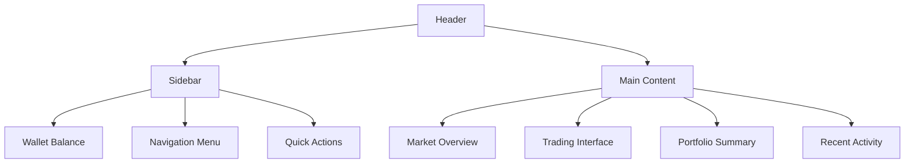
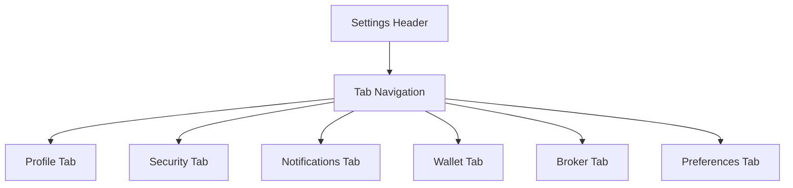
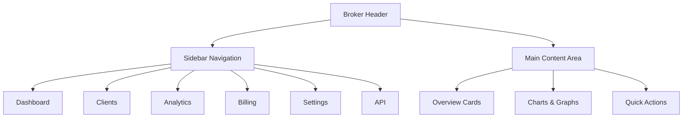
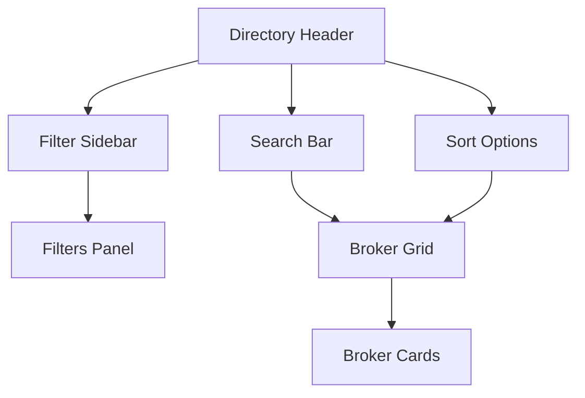

# UI Layout Specification

## Overview

This document provides detailed specifications for all user interfaces in the ViralFX platform, including layouts, components, responsive design, and user experience patterns.

## Implementation Status: ✅ **ANT DESIGN IMPLEMENTED**

The ViralFX frontend is built using **Ant Design** as the primary UI component library, complemented by Tailwind CSS for custom styling. All major screens have been implemented and are production-ready.

## Table of Contents

1. [Design System](#design-system)
2. [Implementation Status](#implementation-status)
3. [User Settings Page](#user-settings-page) ✅ **IMPLEMENTED**
4. [Broker Dashboard](#broker-dashboard) ✅ **IMPLEMENTED**
5. [Notification Center](#notification-center) ✅ **IMPLEMENTED**
6. [Broker Directory](#broker-directory)
7. [Missing Screens](#missing-screens)
8. [Responsive Breakpoints](#responsive-breakpoints)
9. [Component Library](#component-library)
10. [Accessibility Standards](#accessibility-standards)

## Design System

### Color Palette
```css
/* Primary Colors */
--primary-purple: #4B0082;
--primary-purple-light: #6a1b9a;
--primary-purple-dark: #3a0066;

/* Secondary Colors */
--accent-gold: #FFB300;
--accent-gold-light: #ffd54f;
--accent-gold-dark: #ff8f00;

/* Status Colors */
--success-green: #4caf50;
--warning-orange: #ff9800;
--error-red: #f44336;
--info-blue: #2196f3;

/* Neutral Colors */
--text-primary: #212121;
--text-secondary: #757575;
--text-disabled: #bdbdbd;
--background-primary: #ffffff;
--background-secondary: #f5f5f5;
--background-tertiary: #fafafa;

/* Dark Mode */
--dark-bg-primary: #121212;
--dark-bg-secondary: #1e1e1e;
--dark-bg-tertiary: #2d2d2d;
--dark-text-primary: #ffffff;
--dark-text-secondary: #b0b0b0;
```

### Typography
```css
/* Font Stack */
--font-family-primary: 'Inter', -apple-system, BlinkMacSystemFont, sans-serif;
--font-family-mono: 'JetBrains Mono', 'Consolas', monospace;

/* Font Sizes */
--text-xs: 0.75rem;    /* 12px */
--text-sm: 0.875rem;   /* 14px */
--text-base: 1rem;     /* 16px */
--text-lg: 1.125rem;   /* 18px */
--text-xl: 1.25rem;    /* 20px */
--text-2xl: 1.5rem;    /* 24px */
--text-3xl: 1.875rem;  /* 30px */
--text-4xl: 2.25rem;   /* 36px */

/* Font Weights */
--font-light: 300;
--font-normal: 400;
--font-medium: 500;
--font-semibold: 600;
--font-bold: 700;
```

### Spacing System
```css
/* Spacing Scale (8px base) */
--space-1: 0.25rem;  /* 4px */
--space-2: 0.5rem;   /* 8px */
--space-3: 0.75rem;  /* 12px */
--space-4: 1rem;     /* 16px */
--space-5: 1.25rem;  /* 20px */
--space-6: 1.5rem;   /* 24px */
--space-8: 2rem;     /* 32px */
--space-10: 2.5rem;  /* 40px */
--space-12: 3rem;    /* 48px */
--space-16: 4rem;    /* 64px */
```

### Border Radius & Shadows
```css
/* Border Radius */
--radius-sm: 0.25rem;   /* 4px */
--radius-md: 0.5rem;    /* 8px */
--radius-lg: 0.75rem;   /* 12px */
--radius-xl: 1rem;      /* 16px */
--radius-full: 9999px;

/* Shadows */
--shadow-sm: 0 1px 2px 0 rgba(0, 0, 0, 0.05);
--shadow-md: 0 4px 6px -1px rgba(0, 0, 0, 0.1);
--shadow-lg: 0 10px 15px -3px rgba(0, 0, 0, 0.1);
--shadow-xl: 0 20px 25px -5px rgba(0, 0, 0, 0.1);
```

## Implementation Status

### **Primary UI Framework: Ant Design ✅**
- **Component Library**: Ant Design (antd) v5.x
- **Styling**: Tailwind CSS + custom ViralFX theme
- **Icons**: @ant-design/icons
- **State Management**: Zustand stores
- **Routing**: React Router v6

### **Implemented Screens**

#### ✅ Settings Page - `frontend/src/pages/Settings.tsx`
**Status**: **FULLY IMPLEMENTED**
- **Features**: Complete settings interface with tabbed layout
- **Components**: Profile, Security, Notifications, Wallet, Broker, Preferences tabs
- **Ant Design Components Used**: Layout, Card, Tabs, Form, Input, Button, Switch
- **Styling**: Custom ViralFX color scheme integrated with Ant Design theme

#### ✅ Broker Dashboard - `frontend/src/pages/BrokerDashboard.tsx`
**Status**: **FULLY IMPLEMENTED**
- **Features**: Comprehensive broker analytics and client management
- **Components**: Overview cards, client tables, billing charts, analytics
- **Ant Design Components Used**: Layout, Row/Col, Card, Statistic, Table, Progress, Typography, Tabs, Avatar, Tag, Timeline, Alert
- **Charts**: Custom chart components integrated with Ant Design layout

#### ✅ Notification Center - `frontend/src/pages/NotificationCenter.tsx`
**Status**: **FULLY IMPLEMENTED**
- **Features**: Complete notification management system
- **Components**: Notification list, filtering, search, settings
- **Ant Design Components Used**: Layout, Card, List, Typography, Button, Space, Tag, Avatar, Tabs, Input, Select, Badge, Modal, Form, Alert
- **Real-time**: WebSocket integration for live notifications

### **Technical Implementation Details**

#### Ant Design Theme Customization
```typescript
// Custom ViralFX theme integration
const viralFxColors = {
  primaryPurple: '#4B0082',
  primaryPurpleLight: '#6a1b9a',
  accentGold: '#FFB300',
  successGreen: '#4caf50',
  errorRed: '#f44336',
  warningOrange: '#ff9800',
};

// Applied through ConfigProvider for consistent theming
<ConfigProvider
  theme={{
    token: {
      colorPrimary: viralFxColors.primaryPurple,
      colorSuccess: viralFxColors.successGreen,
      colorWarning: viralFxColors.warningOrange,
      colorError: viralFxColors.errorRed,
    },
  }}
>
  <App />
</ConfigProvider>
```

#### Component Architecture
- **Base Components**: Extends Ant Design components with ViralFX branding
- **Layout System**: Responsive grid using Ant Design's Row/Col system
- **Form Handling**: Ant Design Form with React Hook Form integration
- **State Management**: Zustand stores integrated with Ant Design components

## User Trading Dashboard

### Layout Structure


### Header (56px height)
```typescript
interface HeaderProps {
  user: User;
  notifications: Notification[];
  walletBalance: number;
  onMenuToggle: () => void;
  onNotificationClick: () => void;
}

// Header Components:
// - Logo (left)
// - Search bar (center)
// - User menu (right)
// - Notification bell (right)
// - Theme toggle (right)
// - Language selector (right)
```

### Sidebar (280px width)
```typescript
interface SidebarProps {
  isCollapsed: boolean;
  currentPage: string;
  userBalance: WalletBalance;
  onNavigate: (page: string) => void;
}

// Sidebar Sections:
// 1. Wallet Balance Card
// 2. Navigation Menu
// 3. Quick Actions
// 4. Broker Status (if applicable)
// 5. Help & Support
```

#### Wallet Balance Card
```css
.wallet-card {
  background: linear-gradient(135deg, var(--primary-purple), var(--primary-purple-light));
  color: white;
  padding: var(--space-6);
  border-radius: var(--radius-lg);
  margin: var(--space-4);
}

.wallet-balance {
  font-size: var(--text-2xl);
  font-weight: var(--font-bold);
  margin-bottom: var(--space-2);
}

.wallet-change {
  display: flex;
  align-items: center;
  gap: var(--space-2);
  font-size: var(--text-sm);
}

.wallet-change.positive {
  color: #4caf50;
}

.wallet-change.negative {
  color: #f44336;
}
```

#### Navigation Menu
```typescript
const navigationItems = [
  {
    id: 'dashboard',
    label: 'Dashboard',
    icon: 'DashboardOutlined',
    path: '/dashboard'
  },
  {
    id: 'trading',
    label: 'Trading',
    icon: 'StockOutlined',
    path: '/trading'
  },
  {
    id: 'portfolio',
    label: 'Portfolio',
    icon: 'PieChartOutlined',
    path: '/portfolio'
  },
  {
    id: 'markets',
    label: 'Markets',
    icon: 'TrendingUpOutlined',
    path: '/markets'
  },
  {
    id: 'analytics',
    label: 'Analytics',
    icon: 'BarChartOutlined',
    path: '/analytics'
  },
  {
    id: 'settings',
    label: 'Settings',
    icon: 'SettingOutlined',
    path: '/settings'
  }
];
```

### Main Content Area
```typescript
interface MainContentProps {
  children: React.ReactNode;
  pageTitle: string;
  breadcrumb?: BreadcrumbItem[];
  actions?: React.ReactNode;
}

// Layout:
// - Breadcrumb navigation (optional)
// - Page title with actions
// - Content area with proper spacing
// - Footer with pagination if needed
```

#### Trading Interface
```typescript
interface TradingInterfaceProps {
  symbol: string;
  marketData: MarketData;
  orderBook: OrderBook;
  recentTrades: Trade[];
  userOrders: Order[];
  onPlaceOrder: (order: PlaceOrderDto) => void;
}

// Components:
// 1. Price Chart (Candlestick/Line)
// 2. Order Book (Buy/Sell orders)
// 3. Recent Trades
// 4. Place Order Form
// 5. Open Orders
// 6. Trading History
```

## User Settings Page

### Layout Structure


### Tab Navigation
```typescript
const settingsTabs = [
  {
    key: 'profile',
    label: 'Profile',
    icon: 'UserOutlined',
    component: ProfileTab
  },
  {
    key: 'security',
    label: 'Security',
    icon: 'LockOutlined',
    component: SecurityTab
  },
  {
    key: 'notifications',
    label: 'Notifications',
    icon: 'BellOutlined',
    component: NotificationsTab
  },
  {
    key: 'wallet',
    label: 'Wallet',
    icon: 'WalletOutlined',
    component: WalletTab
  },
  {
    key: 'broker',
    label: 'Broker',
    icon: 'TeamOutlined',
    component: BrokerTab
  },
  {
    key: 'preferences',
    label: 'Preferences',
    icon: 'SettingOutlined',
    component: PreferencesTab
  }
];
```

### Profile Tab
```typescript
interface ProfileTabProps {
  user: User;
  onUpdateProfile: (data: UpdateProfileDto) => Promise<void>;
  onUploadAvatar: (file: File) => Promise<string>;
}

// Form Sections:
// 1. Avatar Upload (with preview and crop)
// 2. Personal Information (name, email, phone)
// 3. Location Information (country, timezone)
// 4. Bio/Description
// 5. Verification Status
```

### Security Tab
```typescript
interface SecurityTabProps {
  user: User;
  onChangePassword: (data: ChangePasswordDto) => Promise<void>;
  onEnable2FA: () => Promise<void>;
  onDisable2FA: () => Promise<void>;
  activeSessions: Session[];
  onRevokeSession: (sessionId: string) => Promise<void>;
}

// Sections:
// 1. Password Change
// 2. Two-Factor Authentication
// 3. Active Sessions
// 4. Login History
// 5. Connected Applications
```

### Notification Tab
```typescript
interface NotificationsTabProps {
  preferences: NotificationPreferences;
  onUpdatePreferences: (prefs: NotificationPreferences) => Promise<void>;
  onTestNotification: (type: NotificationType) => Promise<void>;
}

// Sections:
// 1. Email Notifications (toggles)
// 2. Push Notifications (browser permission)
// 3. SMS Notifications (phone verification required)
// 4. Notification Frequency
// 5. Quiet Hours
```

### Wallet Tab
```typescript
interface WalletTabProps {
  wallet: Wallet;
  paymentMethods: PaymentMethod[];
  transactions: Transaction[];
  onAddPaymentMethod: (method: CreatePaymentMethodDto) => Promise<void>;
  onWithdraw: (data: WithdrawDto) => Promise<void>;
}

// Sections:
// 1. Wallet Balance Overview
// 2. Linked Payment Methods
// 3. Withdrawal Settings
// 4. Transaction History
// 5. Wallet Addresses (crypto)
```

### Broker Tab
```typescript
interface BrokerTabProps {
  user: User;
  broker?: Broker;
  availableBrokers: Broker[];
  onLinkBroker: (brokerId: string) => Promise<void>;
  onUnlinkBroker: () => Promise<void>;
}

// Sections:
// 1. Current Broker Status
// 2. Browse Available Brokers
// 3. Link/Unlink Broker Flow
// 4. Broker Communication Preferences
// 5. Broker-Specific Features
```

## Broker Dashboard

### Layout Structure


### Broker Header
```typescript
interface BrokerHeaderProps {
  broker: Broker;
  unreadNotifications: number;
  onNotificationClick: () => void;
  onMenuToggle: () => void;
}

// Components:
// - Broker Logo & Name
// - Tier Badge
// - Verification Status
// - Quick Stats (clients, revenue)
// - Notifications Bell
// - User Menu
```

### Sidebar Navigation
```typescript
const brokerNavigation = [
  {
    key: 'overview',
    label: 'Overview',
    icon: 'DashboardOutlined',
    path: '/broker/dashboard'
  },
  {
    key: 'clients',
    label: 'Clients',
    icon: 'TeamOutlined',
    path: '/broker/clients'
  },
  {
    key: 'analytics',
    label: 'Analytics',
    icon: 'BarChartOutlined',
    path: '/broker/analytics'
  },
  {
    key: 'billing',
    label: 'Billing',
    icon: 'DollarOutlined',
    path: '/broker/billing'
  },
  {
    key: 'settings',
    label: 'Settings',
    icon: 'SettingOutlined',
    path: '/broker/settings'
  },
  {
    key: 'api',
    label: 'API',
    icon: 'ApiOutlined',
    path: '/broker/api'
  }
];
```

### Overview Cards
```typescript
interface OverviewCard {
  title: string;
  value: string | number;
  change?: {
    value: number;
    type: 'increase' | 'decrease';
    period: string;
  };
  icon: React.ReactNode;
  color: string;
  trend?: number[];
}

const overviewCards: OverviewCard[] = [
  {
    title: 'Monthly Earnings',
    value: 'R 125,430',
    change: { value: 12.5, type: 'increase', period: 'vs last month' },
    icon: <DollarOutlined />,
    color: '#4caf50',
    trend: [100000, 110000, 105000, 115000, 125430]
  },
  {
    title: 'Active Clients',
    value: 847,
    change: { value: 8.2, type: 'increase', period: 'vs last month' },
    icon: <TeamOutlined />,
    color: '#2196f3',
    trend: [780, 795, 800, 820, 847]
  },
  {
    title: 'Total Volume',
    value: 'R 12.5M',
    change: { value: 15.3, type: 'increase', period: 'vs last month' },
    icon: <TrendingUpOutlined />,
    color: '#ff9800',
    trend: [10000000, 10500000, 11000000, 11800000, 12500000]
  },
  {
    title: 'Commission Rate',
    value: '30%',
    change: { value: 0, type: 'increase', period: 'fixed' },
    icon: <PercentageOutlined />,
    color: '#9c27b0'
  }
];
```

### Client Management Table
```typescript
interface ClientData {
  id: string;
  name: string;
  email: string;
  status: 'active' | 'inactive' | 'suspended';
  joinDate: Date;
  totalTrades: number;
  totalVolume: number;
  commissionGenerated: number;
  lastActivity: Date;
  attributionType: AttributionType;
}

// Table Columns:
// - Client Name & Avatar
// - Status Badge
// - Join Date
// - Trading Metrics
// - Commission Generated
// - Last Activity
// - Actions (view details, contact)
```

## Notification Center

### Layout Structure
```typescript
interface NotificationCenterProps {
  notifications: Notification[];
  unreadCount: number;
  onMarkAsRead: (id: string) => void;
  onMarkAllAsRead: () => void;
  onDeleteNotification: (id: string) => void;
  onFilterChange: (filter: NotificationFilter) => void;
}
```

### Dropdown Panel (380px width, 500px max height)
```css
.notification-dropdown {
  background: white;
  border-radius: var(--radius-lg);
  box-shadow: var(--shadow-xl);
  border: 1px solid var(--color-gray-200);
  max-height: 500px;
  overflow: hidden;
}

.notification-header {
  padding: var(--space-4) var(--space-6);
  border-bottom: 1px solid var(--color-gray-200);
  display: flex;
  justify-content: space-between;
  align-items: center;
}

.notification-filters {
  display: flex;
  gap: var(--space-2);
  padding: var(--space-3) var(--space-6);
  border-bottom: 1px solid var(--color-gray-200);
}

.notification-list {
  max-height: 350px;
  overflow-y: auto;
}

.notification-item {
  padding: var(--space-4);
  border-bottom: 1px solid var(--color-gray-100);
  cursor: pointer;
  transition: background-color 0.2s ease;
}

.notification-item:hover {
  background-color: var(--background-secondary);
}

.notification-item.unread {
  background-color: #f0f9ff;
  border-left: 3px solid var(--info-blue);
}
```

### Notification Item Component
```typescript
interface NotificationItemProps {
  notification: Notification;
  onRead: (id: string) => void;
  onClick: (notification: Notification) => void;
}

// Notification Types:
// - ORDER_FILLED (green)
// - ORDER_CANCELLED (orange)
// - PRICE_ALERT (blue)
// - PAYMENT_RECEIVED (green)
// - SYSTEM_UPDATE (purple)
// - BROKER_ANNOUNCEMENT (gold)
```

## Broker Directory

### Layout Structure


### Filter Sidebar (300px width)
```typescript
interface FilterPanelProps {
  filters: BrokerFilters;
  onFiltersChange: (filters: BrokerFilters) => void;
  availableTiers: BrokerTier[];
  availableStatuses: BrokerStatus[];
}

// Filter Categories:
// 1. Search by name/registration
// 2. Broker Tiers (checkboxes)
// 3. Status (verified, etc.)
// 4. Minimum Client Count
// 5. Average Rating
// 6. Location/Country
// 7. Services Offered
```

### Broker Card (320px width)
```typescript
interface BrokerCardProps {
  broker: Broker;
  onViewDetails: (brokerId: string) => void;
  onLinkBroker: (brokerId: string) => void;
}

// Card Content:
// - Broker Logo & Name
// - Verification Badge
// - Tier Badge
// - Trust Score
// - Rating & Reviews
// - Client Count
// - Minimum Deposit
// - Commission Rate
// - Services List
// - Action Buttons
```

```css
.broker-card {
  background: white;
  border-radius: var(--radius-lg);
  box-shadow: var(--shadow-md);
  padding: var(--space-6);
  transition: all 0.3s ease;
  border: 1px solid var(--color-gray-200);
}

.broker-card:hover {
  box-shadow: var(--shadow-lg);
  transform: translateY(-2px);
}

.broker-header {
  display: flex;
  align-items: center;
  gap: var(--space-4);
  margin-bottom: var(--space-4);
}

.broker-logo {
  width: 60px;
  height: 60px;
  border-radius: var(--radius-md);
  object-fit: cover;
  border: 2px solid var(--color-gray-200);
}

.broker-info {
  flex: 1;
}

.broker-name {
  font-size: var(--text-lg);
  font-weight: var(--font-semibold);
  margin-bottom: var(--space-1);
}

.broker-badges {
  display: flex;
  gap: var(--space-2);
  flex-wrap: wrap;
}

.verification-badge {
  background: var(--success-green);
  color: white;
  padding: var(--space-1) var(--space-3);
  border-radius: var(--radius-full);
  font-size: var(--text-xs);
  font-weight: var(--font-medium);
}

.tier-badge {
  background: var(--primary-purple);
  color: white;
  padding: var(--space-1) var(--space-3);
  border-radius: var(--radius-full);
  font-size: var(--text-xs);
  font-weight: var(--font-medium);
}
```

## Missing Screens

### **Current Route Configuration Analysis**
Based on `frontend/src/App.tsx`, several routes are defined but the corresponding page components are missing:

#### **High Priority Missing Pages**

1. **Home/Landing Page** (`/`) - *Missing*
   - **Purpose**: Marketing landing page and user acquisition
   - **Ant Design Components Needed**: Layout, Typography, Button, Card, Row/Col
   - **Features**: Hero section, feature highlights, social proof, CTAs

2. **Login Page** (`/login`) - *Missing*
   - **Purpose**: User authentication
   - **Ant Design Components Needed**: Form, Input, Button, Card, Typography
   - **Features**: Email/password form, social login, forgot password link

3. **Register Page** (`/register`) - *Missing*
   - **Purpose**: New user registration
   - **Ant Design Components Needed**: Form, Input, Button, Steps, Card
   - **Features**: Multi-step registration, KYC integration, terms acceptance

4. **Legal Pages** - *Missing*
   - **Terms of Service** (`/terms`) - Legal terms and conditions
   - **Privacy Policy** (`/privacy`) - POPIA compliance
   - **Disclaimer** (`/disclaimer`) - Financial risk disclaimer
   - **Ant Design Components Needed**: Typography, Layout, Card

#### **Medium Priority Missing Pages**

5. **User Dashboard** (`/dashboard`) - *Missing*
   - **Purpose**: Main trading interface
   - **Ant Design Components Needed**: Layout, Row/Col, Card, Statistic, Table, Charts
   - **Features**: Portfolio overview, trending topics, quick actions

6. **Markets Pages** - *Missing*
   - **Markets Overview** (`/markets`) - Market discovery
   - **Market Detail** (`/markets/:symbol`) - Individual market analysis
   - **Ant Design Components Needed**: Table, Card, Typography, Row/Col, Filters

7. **Topics Pages** - *Missing*
   - **Topics List** (`/topics`) - Trending topics
   - **Topic Detail** (`/topics/:id`) - Topic analysis
   - **Ant Design Components Needed**: List, Card, Tag, Typography, Timeline

### **Implementation Recommendations**

#### **Development Priority**
1. **Phase 1**: Authentication pages (Login, Register, ForgotPassword)
2. **Phase 2**: Legal pages (Terms, Privacy, Disclaimer)
3. **Phase 3**: User Dashboard and basic trading interface
4. **Phase 4**: Markets and Topics pages

#### **Technical Approach**
- **Consistent Design**: Follow established Ant Design patterns from implemented screens
- **Theme Integration**: Use existing ViralFX color scheme and ConfigProvider setup
- **Component Reuse**: Leverage common components from Settings and BrokerDashboard
- **Responsive Design**: Follow mobile-first approach demonstrated in implemented screens

#### **File Structure for Missing Pages**
```
frontend/src/pages/
├── Home.tsx                    # Landing page
├── Login.tsx                   # Authentication
├── Register.tsx                # Registration
├── ForgotPassword.tsx          # Password reset
├── TermsOfService.tsx          # Legal terms
├── PrivacyPolicy.tsx           # Privacy policy
├── Disclaimer.tsx              # Risk disclaimer
├── Dashboard.tsx               # User dashboard
├── Markets.tsx                 # Markets overview
├── MarketDetail.tsx            # Market detail
├── Topics.tsx                  # Topics list
└── TopicDetail.tsx             # Topic detail
```

## Responsive Breakpoints

### Breakpoint System
```css
/* Mobile First Approach */
/* 0px - 575px: Mobile (portrait) */
@media (max-width: 575px) {
  .sidebar { transform: translateX(-100%); }
  .main-content { margin-left: 0; }
  .broker-card { width: 100%; }
}

/* 576px - 767px: Mobile (landscape) */
@media (min-width: 576px) and (max-width: 767px) {
  .broker-grid { grid-template-columns: repeat(2, 1fr); }
  .overview-cards { grid-template-columns: repeat(2, 1fr); }
}

/* 768px - 991px: Tablet */
@media (min-width: 768px) and (max-width: 991px) {
  .sidebar { width: 260px; }
  .main-content { margin-left: 260px; }
  .broker-grid { grid-template-columns: repeat(3, 1fr); }
  .overview-cards { grid-template-columns: repeat(2, 1fr); }
}

/* 992px - 1199px: Desktop (small) */
@media (min-width: 992px) and (max-width: 1199px) {
  .sidebar { width: 280px; }
  .main-content { margin-left: 280px; }
  .broker-grid { grid-template-columns: repeat(3, 1fr); }
  .overview-cards { grid-template-columns: repeat(4, 1fr); }
}

/* 1200px+: Desktop (large) */
@media (min-width: 1200px) {
  .sidebar { width: 280px; }
  .main-content { margin-left: 280px; }
  .broker-grid { grid-template-columns: repeat(4, 1fr); }
  .overview-cards { grid-template-columns: repeat(4, 1fr); }
}
```

### Mobile Adaptations

#### Header on Mobile
```css
@media (max-width: 767px) {
  .header {
    padding: var(--space-3);
  }

  .header-search {
    display: none; /* Hidden on mobile */
  }

  .header-actions {
    gap: var(--space-2);
  }

  .logo-text {
    display: none; /* Show only icon on mobile */
  }
}
```

#### Trading Interface on Mobile
```css
@media (max-width: 767px) {
  .trading-interface {
    flex-direction: column;
  }

  .price-chart {
    height: 300px;
    margin-bottom: var(--space-4);
  }

  .order-book {
    height: 250px;
  }

  .place-order-form {
    position: fixed;
    bottom: 0;
    left: 0;
    right: 0;
    background: white;
    padding: var(--space-4);
    border-top: 1px solid var(--color-gray-200);
    z-index: 1000;
  }
}
```

#### Settings on Mobile
```css
@media (max-width: 767px) {
  .settings-tabs {
    overflow-x: auto;
    white-space: nowrap;
    -webkit-overflow-scrolling: touch;
  }

  .settings-tab {
    display: inline-block;
    min-width: 120px;
  }

  .settings-content {
    padding: var(--space-4);
  }

  .form-row {
    flex-direction: column;
    gap: var(--space-2);
  }
}
```

## Component Library

### **Primary Component Library: Ant Design ✅**

The ViralFX platform uses **Ant Design (antd)** as its primary component library, providing a comprehensive set of high-quality React components with consistent design and excellent accessibility.

#### **Core Ant Design Components Used**

**Layout & Structure:**
- `Layout` - Main application layout (Header, Content, Sider, Footer)
- `Row` / `Col` - Responsive grid system
- `Space` - Spacing and alignment
- `Divider` - Content separation

**Navigation:**
- `Menu` - Navigation menus
- `Breadcrumb` - Navigation breadcrumbs
- `Tabs` - Tabbed interfaces
- `Pagination` - Content pagination

**Data Display:**
- `Table` - Data tables with sorting/filtering
- `List` - Simple list display
- `Card` - Content cards
- `Statistic` - Data statistics display
- `Progress` - Progress indicators
- `Tag` - Status tags
- `Avatar` - User avatars

**Form Components:**
- `Form` - Form management with validation
- `Input` - Text input fields
- `Select` - Dropdown selections
- `DatePicker` - Date selection
- `Button` - Action buttons
- `Switch` - Toggle switches
- `Checkbox` - Multiple selections
- `Radio` - Single selections

**Feedback:**
- `Alert` - Alert messages
- `Message` - Toast notifications
- `Modal` - Dialog windows
- `Tooltip` - Hover tooltips
- `Spin` - Loading indicators
- `Empty` - Empty state display

#### **Custom ViralFX Components**

Based on Ant Design, ViralFX implements custom themed components:

### Button Component (Ant Design Based)
```typescript
interface ButtonProps {
  variant: 'primary' | 'secondary' | 'outline' | 'ghost' | 'danger';
  size: 'sm' | 'md' | 'lg';
  loading?: boolean;
  disabled?: boolean;
  icon?: React.ReactNode;
  iconPosition?: 'left' | 'right';
  fullWidth?: boolean;
  children: React.ReactNode;
  onClick?: () => void;
}

const Button: React.FC<ButtonProps> = ({
  variant = 'primary',
  size = 'md',
  loading = false,
  disabled = false,
  icon,
  iconPosition = 'left',
  fullWidth = false,
  children,
  onClick,
  ...props
}) => {
  return (
    <button
      className={`
        btn
        btn-${variant}
        btn-${size}
        ${fullWidth ? 'btn-full-width' : ''}
        ${loading ? 'btn-loading' : ''}
        ${disabled ? 'btn-disabled' : ''}
      `}
      onClick={onClick}
      disabled={disabled || loading}
      {...props}
    >
      {loading && <Spinner size="sm" />}
      {icon && iconPosition === 'left' && icon}
      {children}
      {icon && iconPosition === 'right' && icon}
    </button>
  );
};
```

### Card Component
```typescript
interface CardProps {
  children: React.ReactNode;
  title?: string;
  subtitle?: string;
  actions?: React.ReactNode;
  hoverable?: boolean;
  loading?: boolean;
  className?: string;
}

const Card: React.FC<CardProps> = ({
  children,
  title,
  subtitle,
  actions,
  hoverable = false,
  loading = false,
  className = '',
  ...props
}) => {
  return (
    <div
      className={`
        card
        ${hoverable ? 'card-hoverable' : ''}
        ${loading ? 'card-loading' : ''}
        ${className}
      `}
      {...props}
    >
      {(title || subtitle || actions) && (
        <div className="card-header">
          <div className="card-title-section">
            {title && <h3 className="card-title">{title}</h3>}
            {subtitle && <p className="card-subtitle">{subtitle}</p>}
          </div>
          {actions && <div className="card-actions">{actions}</div>}
        </div>
      )}
      <div className="card-content">{children}</div>
    </div>
  );
};
```

### Input Component
```typescript
interface InputProps {
  type?: 'text' | 'email' | 'password' | 'number' | 'tel';
  label?: string;
  placeholder?: string;
  error?: string;
  helperText?: string;
  required?: boolean;
  disabled?: boolean;
  prefix?: React.ReactNode;
  suffix?: React.ReactNode;
  size?: 'sm' | 'md' | 'lg';
  fullWidth?: boolean;
  value?: string;
  onChange?: (value: string) => void;
}

const Input: React.FC<InputProps> = ({
  type = 'text',
  label,
  placeholder,
  error,
  helperText,
  required = false,
  disabled = false,
  prefix,
  suffix,
  size = 'md',
  fullWidth = false,
  value,
  onChange,
  ...props
}) => {
  return (
    <div className={`input-wrapper ${fullWidth ? 'input-full-width' : ''}`}>
      {label && (
        <label className="input-label">
          {label}
          {required && <span className="input-required">*</span>}
        </label>
      )}
      <div className={`input-container ${error ? 'input-error' : ''}`}>
        {prefix && <span className="input-prefix">{prefix}</span>}
        <input
          type={type}
          className={`input input-${size}`}
          placeholder={placeholder}
          value={value}
          onChange={(e) => onChange?.(e.target.value)}
          disabled={disabled}
          {...props}
        />
        {suffix && <span className="input-suffix">{suffix}</span>}
      </div>
      {error && <span className="input-error-text">{error}</span>}
      {helperText && <span className="input-helper-text">{helperText}</span>}
    </div>
  );
};
```

## Accessibility Standards

### WCAG 2.1 AA Compliance

#### Color Contrast
- **Normal Text**: At least 4.5:1 contrast ratio
- **Large Text**: At least 3:1 contrast ratio
- **Interactive Elements**: At least 3:1 contrast ratio
- **Icons**: At least 3:1 contrast ratio with background

#### Keyboard Navigation
```typescript
// All interactive elements must be keyboard accessible
const handleKeyDown = (event: KeyboardEvent) => {
  switch (event.key) {
    case 'Enter':
    case ' ':
      // Activate element
      break;
    case 'Escape':
      // Close or cancel
      break;
    case 'Tab':
      // Navigate to next element
      break;
  }
};
```

#### Screen Reader Support
```typescript
// ARIA labels and descriptions
<button
  aria-label="Close notification"
  aria-describedby="notification-description"
>
  ×
</button>

<div
  role="alert"
  aria-live="polite"
  id="notification-description"
>
  Your order has been filled
</div>
```

#### Focus Management
```css
/* Visible focus indicators */
.focusable:focus {
  outline: 2px solid var(--primary-purple);
  outline-offset: 2px;
}

/* Skip to main content link */
.skip-link {
  position: absolute;
  top: -40px;
  left: 6px;
  background: var(--primary-purple);
  color: white;
  padding: 8px;
  text-decoration: none;
  z-index: 10000;
}

.skip-link:focus {
  top: 6px;
}
```

#### Semantic HTML
```typescript
// Proper heading structure
const PageLayout = () => (
  <>
    <header role="banner">
      <h1>ViralFX Trading Platform</h1>
    </header>

    <nav role="navigation" aria-label="Main navigation">
      {/* Navigation menu */}
    </nav>

    <main role="main">
      <section aria-labelledby="dashboard-title">
        <h2 id="dashboard-title">Dashboard</h2>
        {/* Dashboard content */}
      </section>
    </main>

    <aside role="complementary" aria-label="Sidebar">
      {/* Sidebar content */}
    </aside>

    <footer role="contentinfo">
      {/* Footer content */}
    </footer>
  </>
);
```

## Performance Considerations

### Lazy Loading
```typescript
// Code splitting for large components
const BrokerDashboard = lazy(() => import('./pages/BrokerDashboard'));
const NotificationCenter = lazy(() => import('./components/notifications/NotificationCenter'));

// Image lazy loading
const LazyImage: React.FC<{ src: string; alt: string }> = ({ src, alt }) => (
  
);
```

### Virtual Scrolling
```typescript
// For large lists (notifications, transactions, etc.)
import { FixedSizeList as List } from 'react-window';

const VirtualizedList: React.FC<{ items: any[] }> = ({ items }) => (
  <List
    height={400}
    itemCount={items.length}
    itemSize={80}
    itemData={items}
  >
    {({ index, style, data }) => (
      <div style={style}>
        {/* Render item */}
      </div>
    )}
  </List>
);
```

### Memoization
```typescript
// React.memo for expensive components
const BrokerCard = React.memo<BrokerCardProps>(({ broker, onViewDetails, onLinkBroker }) => {
  // Component implementation
}, (prevProps, nextProps) => {
  // Custom comparison logic
  return prevProps.broker.id === nextProps.broker.id &&
         prevProps.broker.updatedAt === nextProps.broker.updatedAt;
});

// useMemo for expensive calculations
const expensiveValue = useMemo(() => {
  return calculateComplexValue(data);
}, [data]);
```

---

**Document Version**: 1.0
**Last Updated**: November 2024
**Next Review**: February 2025

For questions or updates to this specification, contact the ViralFX design team.