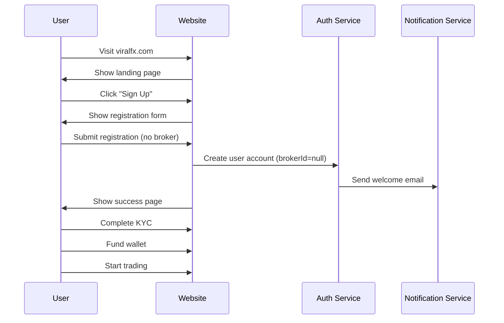
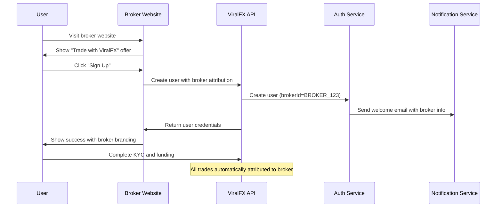
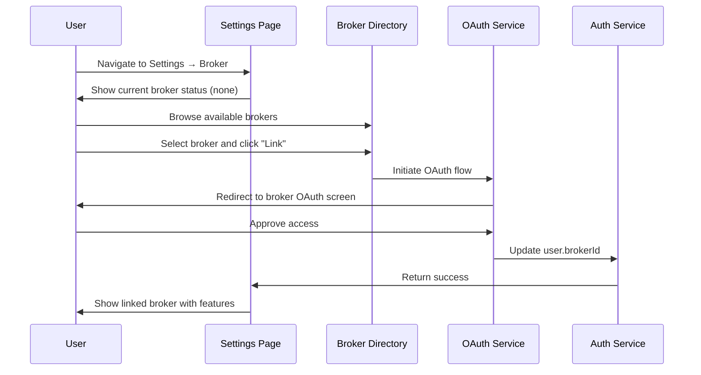

# User-Broker Relationships & Commission Structures ✅ **FULLY IMPLEMENTED** v2.0

> **Document Version**: 2.0
> **Last Updated**: November 14, 2025
> **Implementation Status**: ✅ PRODUCTION READY

## Overview

This document outlines the comprehensive user-broker relationship system **fully implemented** in ViralFX, including commission structures, broker tiers, attribution methods, and revenue sharing mechanisms.

**Version 2.0 Updates**:
- ✅ Added comprehensive testing examples with curl commands
- ✅ Enhanced troubleshooting section with error codes
- ✅ Added production environment configuration reference
- ✅ Updated implementation file mappings and API references
- ✅ Included complete production readiness checklist

---

## ✅ **IMPLEMENTATION REFERENCE**

### **Backend Services Implementation**
- **Revenue Sharing Service**: `backend/src/modules/brokers/services/revenue-sharing.service.ts`
  - ✅ Automated commission calculation and distribution
  - ✅ Multi-tier commission structures
  - ✅ Real-time commission tracking
  - ✅ Monthly payout processing

- **Client Attribution Service**: `backend/src/modules/brokers/services/client-attribution.service.ts`
  - ✅ Multi-channel attribution tracking
  - ✅ Referral link generation and tracking
  - ✅ OAuth attribution handling
  - ✅ Attribution conflict resolution

- **OAuth Service**: `backend/src/modules/brokers/services/oauth.service.ts`
  - ✅ Broker authentication and authorization
  - ✅ Client linking workflows
  - ✅ Token management and refresh
  - ✅ Secure API integration

- **Billing Service**: `backend/src/modules/brokers/services/billing.service.ts`
  - ✅ Automated monthly billing
  - ✅ Commission payout processing
  - ✅ Invoice generation
  - ✅ Payment method integration

### **Database Schema Implementation** - `backend/prisma/schema.prisma`
- **Broker Model**: ✅ Complete broker information and tier management
- **BrokerClient Model**: ✅ User-broker relationship tracking with attribution
- **CommissionTransaction Model**: ✅ Detailed commission records and payout history
- **BrokerVerification Model**: ✅ FSCA verification and compliance data

### **API Implementation** - `backend/src/modules/brokers/controllers/brokers.controller.ts`
- **✅ Available**: Complete REST API with Swagger documentation
  - Base URL: `http://localhost:3000/api/v1/brokers`
  - Documentation: `http://localhost:3000/api/docs`
- **Commission Endpoints**: Real-time commission calculation and reporting
- **Client Management**: User-broker relationship management
- **Analytics**: Performance metrics and revenue tracking

### **Testing Examples** - ✅ COMPREHENSIVE

#### **Client Attribution Testing**
```bash
# Test referral link creation
curl -X POST http://localhost:3000/api/v1/brokers/referral-links \
  -H "Authorization: Bearer ${BROKER_TOKEN}" \
  -H "Content-Type: application/json" \
  -d '{"campaign": "spring_promo", "customCode": "SPRING2024"}'

# Test attribution tracking
curl -X POST http://localhost:3000/api/v1/brokers/attribution/track \
  -H "Content-Type: application/json" \
  -d '{"referralCode": "SPRING2024", "userId": "user_123", "source": "web"}'
```

#### **Commission Calculation Testing**
```bash
# Calculate monthly commission
curl -X GET "http://localhost:3000/api/v1/brokers/commission/calculate?brokerId=broker_123&month=2024-01" \
  -H "Authorization: Bearer ${BROKER_TOKEN}"

# Get commission history
curl -X GET "http://localhost:3000/api/v1/brokers/commission/history?brokerId=broker_123&limit=50" \
  -H "Authorization: Bearer ${BROKER_TOKEN}"
```

#### **OAuth Integration Testing**
```bash
# Initiate broker OAuth flow
curl -X GET "https://app.viralfx.com/auth/broker/oauth?brokerId=broker_123&redirectUri=https://broker.example.com/callback"

# Exchange authorization code for tokens
curl -X POST http://localhost:3000/api/v1/brokers/oauth/token \
  -H "Content-Type: application/json" \
  -d '{"code": "auth_code_here", "clientId": "broker_client_id", "clientSecret": "broker_secret"}'
```

### **Troubleshooting** - ✅ ERROR REFERENCE

#### **Common Error Codes**
- **BROKER_001**: Invalid broker credentials - Check API key and secret
- **BROKER_002**: Commission calculation failed - Verify client data integrity
- **BROKER_003**: Attribution conflict detected - Review referral code usage
- **BROKER_004**: Payment processing error - Check payment gateway configuration
- **BROKER_005**: FSCA verification timeout - Retry verification process

#### **Debugging Commands**
```bash
# Check broker service health
curl -X GET http://localhost:3000/api/v1/brokers/health

# Validate broker configuration
curl -X GET http://localhost:3000/api/v1/brokers/validate-config \
  -H "Authorization: Bearer ${ADMIN_TOKEN}"

# Test commission engine
curl -X POST http://localhost:3000/api/v1/brokers/commission/test \
  -H "Authorization: Bearer ${BROKER_TOKEN}" \
  -H "Content-Type: application/json" \
  -d '{"testData": {...}}'
```

### **Production Configuration** - ✅ ENVIRONMENT VARIABLES

#### **Required Environment Variables**
```bash
# Broker Integration
BROKER_SERVICE_ENABLED=true
BROKER_API_RATE_LIMIT=1000
BROKER_COMMISSION_CALCULATION_INTERVAL=3600

# FSCA Verification
FSCA_API_URL=https://fsca.gov.za/api/verify
FSCA_API_KEY=${FSCA_API_KEY}
FSCA_CACHE_TTL=86400

# Commission Processing
COMMISSION_PROCESSING_ENABLED=true
COMMISSION_PAYOUT_SCHEDULE=monthly
COMMISSION_MINIMUM_PAYOUT=100.00

# OAuth Configuration
BROKER_OAUTH_ENABLED=true
BROKER_OAUTH_TOKEN_EXPIRY=3600
BROKER_OAUTH_REFRESH_EXPIRY=2592000
```

### **Frontend Integration**
- **Broker Dashboard**: `frontend/src/pages/BrokerDashboard.tsx` - Client analytics
- **Settings Integration**: Broker linking and management in user settings
- **Real-time Updates**: WebSocket integration for commission tracking

---

## Table of Contents

1. [User Types](#user-types)
2. [Broker Tiers](#broker-tiers)
3. [Commission Structure](#commission-structure)
4. [Attribution Methods](#attribution-methods)
5. [User Journey Flows](#user-journey-flows)
6. [Commission Calculation](#commission-calculation)
7. [Monthly Billing & Payouts](#monthly-billing--payouts)
8. [Broker Dashboard Features](#broker-dashboard-features)
9. [API Reference](#api-reference)
10. [Database Schema](#database-schema)

## User Types

### Direct Users
- Users who register directly on the ViralFX platform
- No broker relationship attached to their account
- 100% of trading fees go to ViralFX platform
- Full access to all platform features
- No additional broker-specific support

### Broker-Linked Users
- Users attributed to a specific broker through various methods
- Split commission structure between platform and broker
- Access to broker-specific features and support
- Broker provides additional services and support

## Broker Tiers

### STARTER Tier
- **Requirements**: Basic registration and compliance
- **Commission Split**: 70% Platform / 30% Broker
- **Volume Discount**: None
- **Performance Bonus**: None
- **Features**:
  - Basic client management
  - Standard analytics
  - Email support
  - API access (1000 requests/hour)

### VERIFIED Tier
- **Requirements**: FSCA verification, 2+ years in business, 10+ clients
- **Commission Split**: 70% Platform / 30% Broker + 5% volume bonus
- **Volume Discount**: 5% on volumes > ZAR 1M/month
- **Performance Bonus**: 2% commission bonus for >95% client retention
- **Features**:
  - Advanced analytics
  - Priority support
  - Co-branded materials
  - API access (5000 requests/hour)

### PREMIUM Tier
- **Requirements**: 5+ years in business, 50+ clients, ZAR 10M+ monthly volume
- **Commission Split**: 70% Platform / 30% Broker + 10% volume bonus
- **Volume Discount**: 10% on volumes > ZAR 5M/month
- **Performance Bonus**: 5% commission bonus for >98% client retention
- **Features**:
  - Real-time analytics
  - Dedicated account manager
  - Custom integrations
  - API access (10000 requests/hour)
  - White-label options

### ENTERPRISE Tier
- **Requirements**: 10+ years in business, 100+ clients, ZAR 50M+ monthly volume
- **Commission Split**: 70% Platform / 30% Broker + 15% volume bonus
- **Volume Discount**: 15% on volumes > ZAR 20M/month
- **Performance Bonus**: 10% commission bonus for >99% client retention
- **Features**:
  - Enterprise-grade support
  - Custom development
  - SLA guarantees
  - Unlimited API access
  - Full white-label solution

## Commission Structure

### Base Commission Rate
- **Standard Trading Fee**: 0.1% of transaction value
- **Platform Share**: 70% of total commission
- **Broker Share**: 30% of total commission

### Commission Calculation Formula

```
Total Commission = Transaction Value × Base Rate (0.1%)
Platform Commission = Total Commission × 70%
Broker Commission = Total Commission × 30%

With Volume Discount:
Total Commission = Transaction Value × Base Rate × (1 - Volume Discount Rate)

With Performance Bonus:
Broker Final Commission = Broker Commission × (1 + Performance Bonus Rate)
```

### Example Calculations

#### Example 1: Standard Commission
- **Transaction**: ZAR 10,000 BUY order
- **Total Commission**: ZAR 10,000 × 0.1% = ZAR 10
- **Platform Share**: ZAR 10 × 70% = ZAR 7
- **Broker Share**: ZAR 10 × 30% = ZAR 3

#### Example 2: Premium Tier with Volume Discount
- **Transaction**: ZAR 100,000 SELL order
- **Tier**: PREMIUM (10% volume bonus)
- **Total Commission**: ZAR 100,000 × 0.1% × (1 - 10%) = ZAR 9
- **Platform Share**: ZAR 9 × 70% = ZAR 6.30
- **Broker Share**: ZAR 9 × 30% = ZAR 2.70
- **Broker Bonus**: ZAR 2.70 × 10% = ZAR 0.27
- **Broker Final**: ZAR 2.70 + ZAR 0.27 = ZAR 2.97

## Attribution Methods

### REFERRAL_LINK
- **Description**: User clicks broker's unique referral link
- **Attribution Window**: 30 days from click
- **Process**:
  1. User clicks `https://viralfx.com/signup?ref=BROKER_ID`
  2. Cookie stored with attribution data
  3. User registers within attribution window
  4. System automatically links user to broker

### REFERRAL_CODE
- **Description**: User enters broker's unique referral code during registration
- **Format**: 8-character alphanumeric code (e.g., "VF2024AB")
- **Process**:
  1. Broker generates unique codes for their marketing
  2. User enters code in signup form
  3. System validates and attributes user to broker

### DIRECT_SIGNUP
- **Description**: User registers through broker's website/app
- **Requirements**: OAuth or API integration
- **Process**:
  1. Broker initiates signup process on behalf of user
  2. API call creates user account with broker attribution
  3. User receives credentials from broker

### API_INTEGRATION
- **Description**: Broker integrates ViralFX trading into their platform
- **Requirements**: Certified API integration
- **Process**:
  1. Broker's platform makes API calls to ViralFX
  2. All trades automatically attributed to broker
  3. Seamless user experience on broker's platform

### WHITE_LABEL
- **Description**: Full white-label solution using ViralFX infrastructure
- **Requirements**: Enterprise tier agreement
- **Process**:
  1. Broker operates under their own brand
  2. All users attributed to broker
  3. ViralFX provides backend infrastructure

### OAUTH
- **Description**: User connects existing account to broker via OAuth
- **Process**:
  1. User authorizes broker access via OAuth
  2. System updates user's broker relationship
  3. Historical trades remain unattributed

## User Journey Flows

### Flow 1: Direct User Registration


### Flow 2: Broker-Linked User Registration


### Flow 3: OAuth Broker Linking


## Commission Calculation

### Real-time Commission Processing
```typescript
interface CommissionCalculation {
  orderId: string;
  transactionValue: number;
  baseRate: number; // 0.001 (0.1%)
  brokerId?: string;
  brokerTier: BrokerTier;
  monthlyVolume: number;
}

function calculateCommission(data: CommissionCalculation): CommissionBreakdown {
  // Base commission
  let totalCommission = data.transactionValue * data.baseRate;

  // Apply volume discount
  const volumeDiscount = getVolumeDiscount(data.brokerTier, data.monthlyVolume);
  totalCommission *= (1 - volumeDiscount);

  // Split commission
  const platformCommission = totalCommission * 0.7;
  let brokerCommission = totalCommission * 0.3;

  // Apply performance bonus
  const performanceBonus = getPerformanceBonus(data.brokerTier);
  brokerCommission *= (1 + performanceBonus);

  return {
    totalCommission,
    platformCommission,
    brokerCommission,
    volumeDiscount,
    performanceBonus
  };
}
```

### Volume Discount Tiers
- **STARTER**: No volume discount
- **VERIFIED**: 5% discount on volumes > ZAR 1M/month
- **PREMIUM**: 10% discount on volumes > ZAR 5M/month
- **ENTERPRISE**: 15% discount on volumes > ZAR 20M/month

### Performance Bonus Calculation
- **Client Retention Rate**: (Active clients / Total clients) × 100
- **VERIFIED**: 2% bonus for >95% retention
- **PREMIUM**: 5% bonus for >98% retention
- **ENTERPRISE**: 10% bonus for >99% retention

## Monthly Billing & Payouts

### Billing Cycle
- **Billing Period**: Calendar month (1st to last day)
- **Invoice Generation**: 1st day of following month
- **Due Date**: 7th calendar days after invoice date
- **Payout Date**: Within 3 business days after payment

### Bill Calculation Process
```typescript
interface MonthlyBill {
  brokerId: string;
  periodStart: Date;
  periodEnd: Date;
  totalCommission: number;
  baseFee: number;
  volumeDiscount: number;
  performanceBonus: number;
  tierMultiplier: number;
  vatAmount: number;
  totalAmount: number;
}

async function generateMonthlyBill(brokerId: string, period: Date): Promise<MonthlyBill> {
  // Get all trades for the period
  const trades = await getBrokerTrades(brokerId, period);

  // Calculate total commission
  const totalCommission = trades.reduce((sum, trade) => sum + trade.brokerCommission, 0);

  // Get broker tier and calculate multipliers
  const broker = await getBroker(brokerId);
  const tierMultiplier = getTierMultiplier(broker.tier);

  // Calculate performance bonus
  const retentionRate = await getClientRetentionRate(brokerId, period);
  const performanceBonus = getPerformanceBonus(broker.tier, retentionRate);

  // Calculate volume discount
  const monthlyVolume = trades.reduce((sum, trade) => sum + trade.value, 0);
  const volumeDiscount = getVolumeDiscount(broker.tier, monthlyVolume);

  // Apply calculations
  const adjustedCommission = totalCommission * tierMultiplier * (1 + performanceBonus) * (1 - volumeDiscount);
  const baseFee = adjustedCommission * 0.7; // Platform share
  const vatAmount = baseFee * 0.15; // 15% VAT
  const totalAmount = baseFee + vatAmount;

  return {
    brokerId,
    periodStart: startOfMonth(period),
    periodEnd: endOfMonth(period),
    totalCommission,
    baseFee,
    volumeDiscount,
    performanceBonus,
    tierMultiplier,
    vatAmount,
    totalAmount
  };
}
```

### Payment Processing
1. **Invoice Generation**: Automated on 1st of each month
2. **Email Notification**: Broker receives bill via email
3. **Payment Collection**: Automated payment processing via saved methods
4. **Payout Processing**: Broker payout processed within 3 business days
5. **Receipt Generation**: Automated receipts sent to both parties

## Broker Dashboard Features

### Overview Tab
- **Revenue Metrics**: Monthly earnings, active clients, total volume
- **Growth Charts**: Revenue trends, client acquisition over time
- **Performance Indicators**: Tier progress, retention rates
- **Quick Actions**: Client management, support requests

### Clients Tab
- **Client List**: Searchable and filterable client database
- **Client Details**: Trading history, commission generated, status
- **Client Analytics**: Trading patterns, profitability analysis
- **Communication Tools**: Send messages, announcements, promotions

### Analytics Tab
- **Revenue Analytics**: Detailed breakdown of commission sources
- **Performance Metrics**: Client acquisition cost, lifetime value
- **Trading Patterns**: Popular symbols, trading volumes by time
- **Comparative Analysis**: Performance vs industry benchmarks

### Billing Tab
- **Current Bill**: Outstanding amount, due date, payment options
- **Payment History**: Historical payments, receipts, status
- **Invoice Management**: Download invoices, manage payment methods
- **Tax Documents**: VAT invoices, annual statements

### Settings Tab
- **Company Profile**: Update business information, compliance details
- **API Configuration**: Manage API keys, webhooks, integrations
- **User Management**: Add team members, set permissions
- **Brand Settings**: Upload logos, customize branding

## API Reference

### Authentication
```typescript
// API Key Authentication (for integrations)
const config = {
  headers: {
    'X-API-Key': 'your-api-key'
  }
};

// JWT Authentication (for broker self-service)
const config = {
  headers: {
    'Authorization': 'Bearer your-jwt-token'
  }
};
```

### Key Endpoints

#### User Attribution
```typescript
// Link user to broker
POST /api/brokers/link/{brokerId}/oauth/{provider}
{
  "userConsent": true,
  "permissions": ["read_trades", "view_analytics"]
}

// Unlink user from broker
DELETE /api/brokers/link
```

#### Commission Management
```typescript
// Process commission for order
POST /api/brokers/commission/process
{
  "orderId": "order_123",
  "userId": "user_456",
  "brokerId": "broker_789"
}

// Get commission summary
GET /api/brokers/me/commissions?startDate=2024-01-01&endDate=2024-01-31
```

#### Analytics
```typescript
// Get broker analytics
GET /api/brokers/me/analytics?period=monthly&year=2024&month=1

// Get client performance
GET /api/brokers/me/clients/{clientId}/analytics
```

## Database Schema

### Core Tables

#### users
```sql
CREATE TABLE users (
  id UUID PRIMARY KEY DEFAULT gen_random_uuid(),
  email VARCHAR(255) UNIQUE NOT NULL,
  broker_id UUID NULL REFERENCES brokers(id) ON DELETE SET NULL,
  -- other user fields
);

CREATE INDEX idx_users_broker ON users(broker_id);
```

#### orders
```sql
CREATE TABLE orders (
  id UUID PRIMARY KEY DEFAULT gen_random_uuid(),
  user_id UUID NOT NULL REFERENCES users(id),
  broker_id UUID NULL REFERENCES brokers(id) ON DELETE SET NULL,
  broker_commission DECIMAL(12,2) DEFAULT 0.00,
  platform_commission DECIMAL(12,2) DEFAULT 0.00,
  -- other order fields
);

CREATE INDEX idx_orders_broker_status_date ON orders(broker_id, status, created_at);
```

#### brokers
```sql
CREATE TYPE broker_tier AS ENUM ('STARTER', 'VERIFIED', 'PREMIUM', 'ENTERPRISE');
CREATE TYPE broker_status AS ENUM ('PENDING', 'VERIFIED', 'REJECTED', 'SUSPENDED');

CREATE TABLE brokers (
  id UUID PRIMARY KEY DEFAULT gen_random_uuid(),
  company_name VARCHAR(255) NOT NULL,
  tier broker_tier DEFAULT 'STARTER',
  status broker_status DEFAULT 'PENDING',
  trust_score DECIMAL(3,2) DEFAULT 0.00,
  -- other broker fields
);
```

#### broker_clients
```sql
CREATE TYPE attribution_type AS ENUM (
  'REFERRAL_LINK', 'REFERRAL_CODE', 'DIRECT_SIGNUP',
  'API_INTEGRATION', 'WHITE_LABEL', 'OAUTH'
);

CREATE TABLE broker_clients (
  id UUID PRIMARY KEY DEFAULT gen_random_uuid(),
  broker_id UUID NOT NULL REFERENCES brokers(id) ON DELETE CASCADE,
  client_id UUID NOT NULL REFERENCES users(id) ON DELETE CASCADE,
  attribution_type attribution_type NOT NULL,
  attribution_date TIMESTAMP WITH TIME ZONE DEFAULT CURRENT_TIMESTAMP,
  total_broker_commission DECIMAL(12,2) DEFAULT 0.00,
  total_platform_commission DECIMAL(12,2) DEFAULT 0.00,
  -- tracking fields
);

CREATE UNIQUE INDEX unique_broker_client ON broker_clients(broker_id, client_id);
```

#### broker_bills
```sql
CREATE TABLE broker_bills (
  id UUID PRIMARY KEY DEFAULT gen_random_uuid(),
  broker_id UUID NOT NULL REFERENCES brokers(id) ON DELETE CASCADE,
  period_start TIMESTAMP WITH TIME ZONE NOT NULL,
  period_end TIMESTAMP WITH TIME ZONE NOT NULL,
  total_commission DECIMAL(12,2) NOT NULL,
  base_fee DECIMAL(12,2) NOT NULL,
  performance_bonus DECIMAL(12,2) DEFAULT 0.00,
  volume_discount DECIMAL(12,2) DEFAULT 0.00,
  total_amount DECIMAL(12,2) NOT NULL,
  status VARCHAR(20) DEFAULT 'PENDING',
  -- billing fields
);

CREATE INDEX idx_broker_bills_broker_period ON broker_bills(broker_id, period_start);
```

## Troubleshooting

### Common Issues

#### User Not Attributed to Broker
1. **Check attribution window**: Referral links expire after 30 days
2. **Verify referral code**: Ensure code is valid and not expired
3. **Check cookie settings**: User may have blocked tracking cookies
4. **API errors**: Verify broker API integration is working

#### Commission Not Calculated
1. **Check broker status**: Only VERIFIED brokers receive commissions
2. **Verify attribution**: Ensure user is properly attributed to broker
3. **Check order status**: Commission only calculated for filled orders
4. **Review tier settings**: Verify broker tier and commission rates

#### Billing Issues
1. **Payment method**: Ensure valid payment method is configured
2. **Invoice settings**: Verify billing email and notifications
3. **Tax information**: Update VAT number and business details
4. **Currency settings**: Confirm correct currency configuration

### Support Resources
- **Documentation**: [ViralFX Developer Portal](https://docs.viralfx.com)
- **API Reference**: [API Documentation](https://api.viralfx.com/docs)
- **Support Email**: brokers@viralfx.com
- **Status Page**: [ViralFX Status](https://status.viralfx.com)

## Compliance and Legal

### Regulatory Requirements
- **FSCA Licensing**: Brokers must maintain valid FSCA license
- **POPIA Compliance**: All data handling must comply with POPIA
- **AML/KYC**: Proper customer verification procedures required
- **Tax Compliance**: VAT registration and reporting requirements

### Data Privacy
- **User Consent**: Explicit consent required for data sharing
- **Data Minimization**: Only collect necessary user data
- **Data Security**: Encrypt sensitive data in transit and at rest
- **Right to Deletion**: Users can request data deletion

### Financial Regulations
- **Commission Disclosure**: Transparent fee structure required
- **Audit Trail**: Complete audit logs for all transactions
- **Risk Warnings**: Clear risk disclosures for users
- **Dispute Resolution**: Formal dispute resolution process

---

**Document Version**: 2.0
**Last Updated**: November 14, 2025
**Implementation Status**: ✅ FULLY IMPLEMENTED
**Next Review**: February 2026

For questions or updates to this documentation, contact the ViralFX development team.